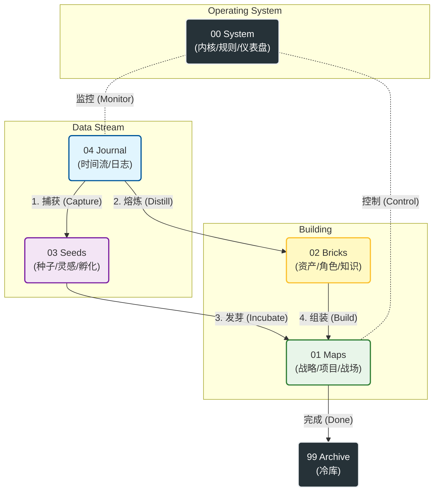

# 🧠 认知架构师：系统哲学 v2.3

> **核心公理（The Core Axiom）：**
> 
> 我们不是在整理笔记，我们是在**设计环境**。
> 
> 意志力是不可靠的，只有**系统**是永恒的。
> 
> 这个目录结构不是仓库，它是你大脑的**外骨骼**。

## 🗺️ 系统架构图 (System Architecture)

Code snippet

---

## 📂 空间总纲：新·五大功能区

为了对抗熵增，我们将系统重构为 **JD (Johnny.Decimal) 变体**。现在的逻辑是：**先有系统(00)，再有战略(01)，最后是执行与积累。**

### 00_System —— 【内核与控制】 (Kernel)

- **地位：** **Root Access (最高权限)**。
    
- **隐喻：** CPU / 宪法 / 中央指挥室。
    
- **内容：**
    
    - `North Star Terminal` (仪表盘)：每日必看的 HUD。
        
    - `Protocols` (协议)：系统的法律文件 (如本文件)。
        
    - `Templates` (模版)：生产工具。
        
- **心法：** 这里的任何变动都会影响全局。它是**不变的**规则集合。
    

### 01_Maps —— 【战略与战场】 (Battlefield)

- **地位：** **Active (当前活跃)**。
    
- **隐喻：** 作战地图 / 施工现场。
    
- **内容：**
    
    - `Active_Projects`：正在交火的项目 (P1/P2)。
        
    - `000_Life_Strategy`：人生战略地图。
        
- **心法：** 这里是**“现在”**。只有正在推进的事情才能进这里。做完就归档，严禁堆积。
    

### 02_Bricks —— 【资产与角色】 (Assets)

- **地位：** **Resource (资源库)**。
    
- **隐喻：** 军火库 / 图书馆 / 角色面板。
    
- **内容：**
    
    - `Character Sheet`：你的人物卡（现在被视为一种核心资产）。
        
    - 知识砖块：不可变的真理与洞见。
        
- **心法：** 这里的东西是**“永恒”**的。它们是你盖楼用的砖头，也是你定义自己的属性。
    

### 03_Seeds —— 【潜能与孵化】 (Incubator)

- **地位：** **Potential (可能性)**。
    
- **隐喻：** 育种室 / 培养皿。
    
- **内容：** 那些闪光的灵感，但还没准备好成为项目（Project）的点子。
    
- **心法：** 允许混乱，但要定期浇水。成熟的种子移入 `01 Maps`，枯死的种子移入 `99 Archive`。
    

### 04_Journal —— 【时间流】 (Stream)

- **地位：** **Input (唯一入口)**。
    
- **隐喻：** 航海日志 / 黑匣子。
    
- **内容：** `2026/1/...` 每日的流水账、审计与复盘。
    
- **心法：** **快**。不要思考分类，先写下来。所有的数据（EXP/MP）都从这里产生。
    

---

## 🔄 二、交互逻辑：数据如何流动？

新的目录结构对应了更高效的 **LifeOS v2.3** 交互循环：

### 1. 记录 (Log) -> `04 Journal`

所有的行为、情绪、时间开销，首先进入每日笔记。这是系统的**感知层**。

- _Action:_ 每天早上新建 Daily Note。
    

### 2. 反馈 (Feedback) -> `00 System` (Terminal)

系统通过 Dataview 自动抓取 `04 Journal` 的数据，在 `North Star Terminal` 实时显示血条 (HP) 和 经验 (EXP)。这是系统的**控制层**。

- _Action:_ 每天查看首页，决定今日行动。
    

### 3. 行动 (Act) -> `01 Maps`

根据仪表盘的指令，进入 `Active_Projects` 执行具体任务。这是系统的**执行层**。

- _Action:_ 打开项目笔记，勾选 `- [x]` 任务，技能熟练度自动提升。
    

### 4. 沉淀 (Save) -> `02 Bricks`

项目结束后，将复用的经验、SOP 提取出来，存入砖块库。这是系统的**存储层**。

---

## ⛔ 维护协议

1. **00 优先原则：** 如果不知道该干嘛，先回 `00 System` 看仪表盘。
    
2. **01 极简原则：** `01 Maps` 里同时进行的项目不要超过 3-5 个。保持战场清晰。
    
3. **99 归档原则：** `Legacy_Inbox` 和旧的项目，一旦结束立刻扔进 `99 Archive`。不要让过去拖累现在。
    

---

**System Status:**

✅ Directory Structure: **Updated**.

✅ Logic Mapping: **Synced**.

✅ Philosophy: **v2.3 Active**.

愿这套新架构成为你征服 2026 的最强外骨骼。🫡